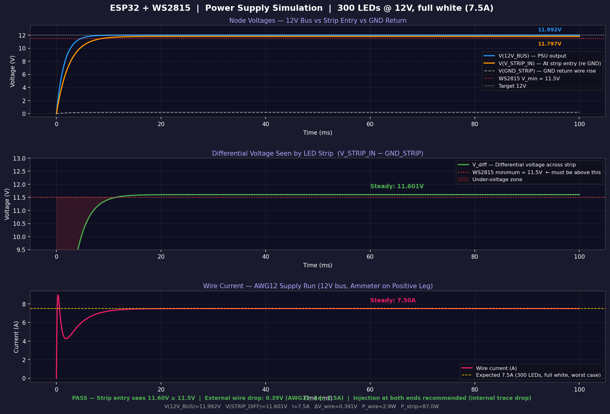

# ESP32 + WS2815 WLED System

Complete hardware design, power analysis, SPICE simulation, and firmware configuration
for two independent ESP32 + WS2815 (12V) addressable LED strip systems running WLED firmware.

Each system is installed at a **separate location** with **no shared components**.

---

## System Summary

| Parameter | Value |
|-----------|-------|
| Microcontroller | ESP32-DevKitC-32D × 2 |
| LED Strip | **WS2815** 60 LED/m, 5m × 2 (300 LEDs each) |
| Strip supply | **12V DC — direct from PSU (no buck converter)** |
| Strip peak current | **~7.5A @ 12V** per strip |
| ESP32 supply | 5V via small MP1584EN/XL4015 buck (12V→5V) per system |
| PSU | **2× Mean Well LRS-150-12** (12V / 12.5A — one per location) |
| Fuse | **10A blade** per system |
| Data signal | 5V via SN74AHCT125N level shifter (ESP32 outputs 3.3V) |
| Firmware | [WLED](https://kno.wled.ge) |
| Deployment | 2 independent systems at separate locations |

---

## Power Simulation (WS2815 @ 12V)



| Result | Value |
|--------|-------|
| Strip entry voltage | **11.60V** ✓ (WS2815 min: 11.5V) |
| External wire drop (AWG12, 5m, 7.5A) | **0.39V** |
| Wire power loss | 2.93W |
| PSU load factor | 61% (7.6A / 12.5A) ✓ |
| Status | **PASS** — injection at both ends recommended |

> **Key difference from WS2812B:** WS2815 is native 12V — no step-down buck converter
> is needed for the strip. Current is ~7.5A @ 12V vs 18A @ 5V for WS2812B.

---

## File Structure

```
├── README.md                  ← This file
├── BOM.md                     ← Bill of Materials (components + pricing in BRL)
├── BOM_Quote.pdf              ← Formal quotation document
├── power_calculation.md       ← Current/voltage/power analysis
├── wiring_diagram.md          ← ASCII schematic + pin assignments
├── led_power_sim.sp           ← SPICE netlist (LTspice / ngspice compatible)
├── engineering_notes.md       ← Design decisions, safety notes, WLED config
├── plot_simulation.py         ← Python script to regenerate Figure_1.png
├── gerar_pdf_bom.py           ← Python script to regenerate BOM_Quote.pdf
├── Figure_1.png               ← Power supply simulation plot
└── wokwi/
    ├── diagram.json           ← Wokwi simulator project
    ├── sketch.ino             ← Arduino test firmware (animations)
    ├── libraries.txt          ← Wokwi library dependencies
    └── wokwi.toml             ← Wokwi project config
```

---

## Architecture

```
Location A                          Location B
──────────────────────────────      ──────────────────────────────
LRS-150-12 (12V / 12.5A)           LRS-150-12 (12V / 12.5A)
   │                                   │
   ├─[10A fuse]──→ WS2815 Strip        ├─[10A fuse]──→ WS2815 Strip
   │               (300 LEDs, 12V)     │               (300 LEDs, 12V)
   │                                   │
   └─→ XL4015 buck (12V→5V)           └─→ XL4015 buck (12V→5V)
         └─→ ESP32 + Level Shifter           └─→ ESP32 + Level Shifter
               └─→ Strip DIN (5V)                  └─→ Strip DIN (5V)

No shared components between systems.
```

---

## Quick Start

### Flash WLED to ESP32
1. Connect ESP32 via USB
2. Open [install.wled.me](https://install.wled.me) in Chrome/Edge
3. Click **Install**, select latest stable firmware
4. Connect to WiFi AP `WLED-AP` (password: `wled1234`)
5. Go to **Config → LED Preferences**:
   - LED Type: **WS2815** (not WS2812B)
   - LED Count: `300`
   - GPIO: `4`
   - Max Current: `6000 mA`

### Simulate in Wokwi
1. Go to [wokwi.com](https://wokwi.com) → New ESP32 project
2. Replace `diagram.json` and `sketch.ino` with files from `wokwi/`
3. Press Play

### Run SPICE Simulation
```bash
ngspice led_power_sim.sp
# or open in LTspice: File → Open → led_power_sim.sp
```

### Regenerate Simulation Plot
```bash
pip install matplotlib numpy
python3 plot_simulation.py
```

### Regenerate BOM PDF
```bash
pip install reportlab
python3 gerar_pdf_bom.py
```

---

## Key Design Decisions

| Decision | Reason |
|----------|--------|
| WS2815 (12V) instead of WS2812B (5V) | Lower current (7.5A vs 18A), fewer wiring concerns, backup data line (BI pin) |
| No buck converter for strip | WS2815 is native 12V — direct PSU connection |
| Two independent PSUs | Systems at separate locations; no shared components |
| 10A fuse (not 25A) | Strip worst case 7.5A; 10A provides protection with margin |
| SN74AHCT125N level shifter | ESP32 GPIO = 3.3V; WS2815 DIN Vih_min ≈ 3.5V — 200mV violation without shifter |
| Power injection at both ends | Internal trace resistance of strip adds drop beyond external wire drop |

---

## Safety Checklist

- [ ] PSU output verified at 12.0V before connecting strip
- [ ] 10A blade fuse on 12V feed per system
- [ ] AWG12 wire for all 12V strip power runs
- [ ] Buck output set to 5.0V before connecting ESP32
- [ ] Power injection at both strip ends
- [ ] WLED LED type: WS2815 (not WS2812B)
- [ ] WLED max current: 6000 mA
- [ ] Level shifter powered from 5V, 330Ω on DIN line
- [ ] 470µF/25V cap at strip 12V entry point
